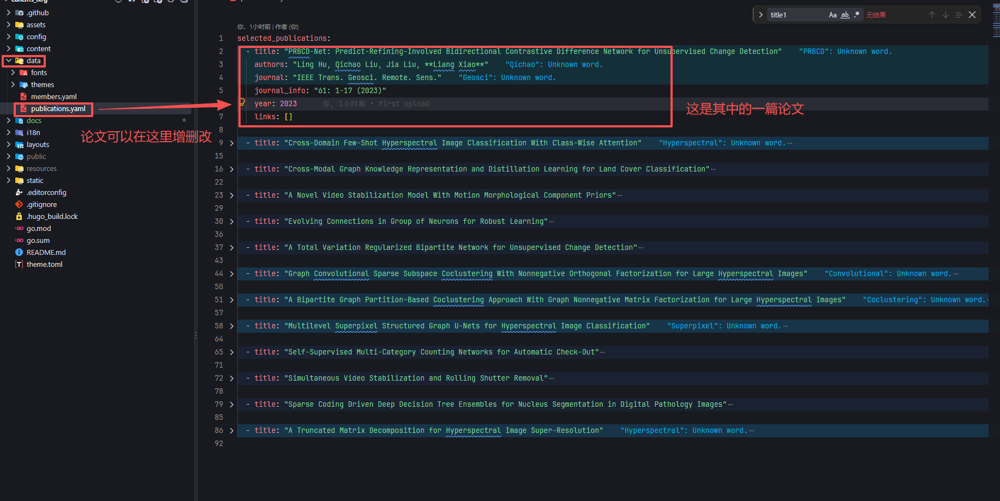
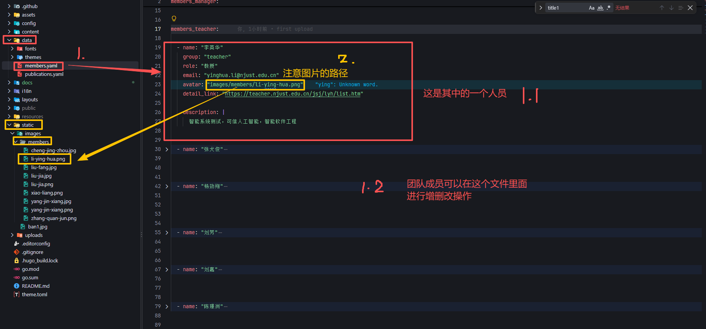

# 网站内容修改操作指南

本指南教你如何在 **GitHub 网页上**直接修改网站各个页面的内容，不需要安装任何软件。

---

## 一、先了解两件事

### 1. 网站菜单和文件对应关系

网站顶部导航栏的每一个菜单，都对应一个文件。想改哪个页面，就改对应的文件：

| 菜单名称 | 要修改的文件位置 |
|---------|----------------|
| 研究团队（首页） | `content/zh/_index.md` |
| 研究项目 | `content/zh/projects/_index.md` |
| 研究成果 | `content/zh/publications/_index.md` |
| 获奖荣誉 | `content/zh/awards/_index.md` |
| 科研简介 | `content/zh/research/_index.md` |
| 招生指南 | `content/zh/recruit/_index.md` |

> 注意：菜单栏本身的名字和顺序在另一个文件里：`config/_default/menus.yaml`。一般不用改它，只改上面表格里的页面内容即可。

### 2. 什么是 Markdown 文件

上面的 `.md` 文件都是「纯文本文件」，用普通文字书写，规则很简单：

- `# 标题` 一个井号表示大标题（最大）
- `## 小标题` 两个井号表示小标题
- `- 内容` 减号加空格表示一条列表项
- `1. 内容` 数字加点和空格表示编号列表
- 空行表示分段（**段落之间必须空一行**）

---

## 二、在 GitHub 网页上修改文件的完整步骤

### 第 1 步：打开仓库

1. 在浏览器打开你们网站的 GitHub 仓库主页（例如 `https://github.com/用户名/仓库名`）。
2. 登录你的 GitHub 账号（没有账号需要先注册并让管理员加权限）。

### 第 2 步：找到要改的文件

1. 在仓库主页点击进入 `content` 文件夹。
2. 再点击 `zh` 文件夹。
3. 再点击对应的页面文件夹（例如 `awards`）。
4. 点击里面的 `_index.md` 文件。

### 第 3 步：进入编辑模式

1. 打开文件后，点击右上角的 **铅笔图标**（✏️，鼠标悬停显示 `Edit this file`）。
2. 页面变成一个可以打字的文本框。

### 第 4 步：修改内容

1. 直接在文本框里修改文字。
2. 只改**文字内容**，不要动最上面两行 `---` 之间的部分（那是系统设置）。
3. 修改过程中可随时点击 **Preview** 标签页预览效果。

### 第 5 步：保存并提交

1. 修改完成后，点击右上角绿色的 **Commit changes** 按钮。
2. 弹窗里：
   - 第一栏填一句简单说明，例如：`更新获奖荣誉`
   - 第二栏可留空
   - 选择 `Commit directly to the main branch`（默认即可）
3. 点击绿色 **Commit changes** 确认。
4. 网站会在 1～3 分钟后自动更新，刷新页面即可看到。

---

## 三、YAML 文件的书写规则（重要！）

每个 `.md` 文件最上面都有一段被 `---` 包起来的内容，叫「前言 / front matter」，
例如：

```
---
title: 获奖荣誉
type: common
page_id: page_awards
---
```

**规则：**

1. **冒号后面必须有一个空格**：`title: 获奖荣誉` ✅ ／ `title:获奖荣誉` ❌
2. **缩进只能用空格，不能用 Tab 键**。一般每层缩进 2 个空格。
3. **对齐要严格**：同一层的字段左边要对齐（同样数量的空格）。
4. **文字不要加引号**（除非文字里本身包含冒号 `:`）。
5. 这段前言**一般不用改**，除非管理员要求改标题。

> 如果保存后发现网站报错，多半是这里的空格或缩进写错了。可以点 GitHub 的 **History** 回退到上一个版本。

---

## 四、各页面具体怎么改

### 1. 研究团队（首页）

- 文件：`content/zh/_index.md`
- 这个页面比较特殊，正文基本为空，团队人员来自另一个数据文件：
  - `data/members.yaml`
- 修改人员信息时，请找管理员协助，或参考该文件里已有成员的写法照葫芦画瓢。

具体怎么修改，请看下面**第六节**的详细说明

### 2. 研究项目

- 文件：`content/zh/projects/_index.md`
- 找到 `## 最新项目：` 和 `## 近期代表性项目：` 下面的列表。
- 添加一条新项目：在列表最后另起一行，按编号往下写，例如：

```
10. 项目名称，来源，编号，起止时间，经费，角色
```

- 删除项目：把那一整行删掉，并重新调整后面的编号。

### 3. 研究成果

- 文件：`content/zh/publications/_index.md`
- 目前正文为空，研究成果主要由 `data/publications.yaml` 数据文件生成。
- **建议**：论文/成果的增删改，请联系管理员协助，避免格式出错。

具体怎么修改，请看下面**第五节**的详细说明

### 4. 获奖荣誉

- 文件：`content/zh/awards/_index.md`
- 找到 `## 🏆 获奖、荣誉称号` 下面的列表。
- 每一条以 `- ` 开头，格式为：`奖项名称，等级，年份，排名`
- 新增：在列表末尾加一行，以 `- ` 开头。
- 修改：直接改那一行的文字。
- 删除：删掉整行。

示例：

```
- “某某科技奖”，二等奖，2025，排名1
```

### 5. 科研简介

- 文件：`content/zh/research/_index.md`
- 目前是占位文字「内容即将上线，敬请期待」。
- 把 `## 科研简介` 下面的文字替换成正式内容即可，支持多段、多标题。

### 6. 招生指南

- 文件：`content/zh/recruit/_index.md`
- 同上，替换「内容即将上线，敬请期待」为正式内容。
- 可用小标题分节，例如：

```
## 招生方向

## 申请条件

## 联系方式
```

---

## 五、研究成果数据（`data/publications.yaml`）

「研究成果」页面的论文列表来自这个文件。文件内容长，改之前**务必先看懂格式再动手**。



### 文件长什么样

```
selected_publications:
  - title: "论文标题"
    authors: "作者1, 作者2, **Liang Xiao**"
    journal: "期刊名称"
    journal_info: "卷期页码 (年份)"
    year: 2023
    links: []

  - title: "下一篇论文标题"
    authors: "..."
    journal: "..."
    journal_info: "..."
    year: 2023
    links: []
```

### 每篇论文的字段说明

| 字段 | 含义 | 写法 |
|------|------|------|
| `title` | 论文标题 | 用英文双引号 `"` 包起来 |
| `authors` | 作者列表 | 逗号分隔；想让某位老师名字**加粗**，就用两个星号包住，如 `**Liang Xiao**` |
| `journal` | 期刊/会议名称 | 用双引号包起来 |
| `journal_info` | 卷期、页码、年份 | 用双引号包起来，如 `"61: 1-17 (2023)"` |
| `year` | 年份 | 直接写数字，**不加引号** |
| `links` | 论文链接 | 没有就写 `[]`；有链接的写法见下方 |

### 新增一篇论文

1. 找到文件里**最上面那篇**论文（最新论文在最前面）。
2. 在 `selected_publications:` 下一行插入一条新记录（注意**所有行都要缩进**，格式对齐已有的论文）：

```
selected_publications:
  - title: "新论文标题"
    authors: "作者A, 作者B, **Liang Xiao**"
    journal: "期刊名称"
    journal_info: "卷: 页码 (年份)"
    year: 2025
    links: []

  - title: "原来的第一篇论文"
    ...（保持不动）
```

3. 关键点：
   - 每条论文以 `  - title:` 开头（**前面是两个空格 + 一个减号 + 一个空格**）。
   - 同一篇的其余字段（`authors`、`journal` 等）前面是 **4 个空格**，与 `title` 的 `t` 对齐。
   - 每篇论文之间**空一行**，便于阅读（也可不空，但不空容易看错）。
   - `year:` 只写数字，例如 `2025`。

### 删除一篇论文

把这篇论文的**所有行**（从 `  - title:` 到 `    links: []`）整段删掉，注意别多删或少删下一行的空行。

### 在论文上加链接

`links: []` 表示暂时没有链接。要加链接，改成：

```
    links:
      - name: "PDF"
        url: "https://example.com/paper.pdf"
      - name: "Code"
        url: "https://github.com/xxx/yyy"
```

- `name` 是链接显示的文字，如 `PDF`、`Code`、`Project`。
- `url` 是完整网址，**必须带 `https://` 开头，并用双引号包起来**。
- 多个链接按上面格式往下排，缩进保持一致。

目前这个多连接的功能暂时留空。

---

## 六、研究团队成员数据（`data/members.yaml`）

「研究团队」页面的成员卡片来自这个文件。文件按身份分成两块：

- `members_manager:` ——负责人（目前是肖亮老师）
- `members_teacher:` ——教师团队



### 文件长什么样

```
members_teacher:

  - name: "李英华"
    group: "teacher"
    role: "教授"
    email: "yinghua.li@njust.edu.cn"
    avatar: "images/members/li-ying-hua.png"
    detail_link: "https://teacher.njust.edu.cn/jsj/lyh/list.htm"

    description: |
      智能系统测试，可信人工智能，智能软件工程
```

### 每位成员的字段说明

| 字段 | 含义 | 写法 |
|------|------|------|
| `name` | 姓名 | 用双引号包起来 |
| `group` | 分组 | 负责人写 `"manager"`，教师写 `"teacher"`，**不要自己乱改** |
| `role` | 职称 | 如 `"教授"`、`"副教授"`，用双引号包起来 |
| `email` | 邮箱 | 用双引号包起来 |
| `avatar` | 头像图片路径 | 用双引号包起来，见下方说明 |
| `detail_link` | 个人主页链接 | 用双引号包起来；没有可留空 `""` |
| `description` | 个人简介 | 特殊写法，见下方说明 |

### 新增一位教师

1. 在 `members_teacher:` 这块里，找到最后一位老师。
2. 在其后面**空一行**，按格式粘贴一份新模板并改成新老师的信息：

```
  - name: "新老师姓名"
    group: "teacher"
    role: "副教授"
    email: "邮箱@njust.edu.cn"
    avatar: "images/members/xxx.png"
    detail_link: "https://..."

    description: |
      研究方向: 这里写这位老师的研究方向。
```

3. 关键点：
   - 每位成员以 `  - name:` 开头（**两个空格 + 减号 + 空格**）。
   - 其余字段前面是 **4 个空格**，与 `name` 的 `n` 对齐。
   - `avatar`、`description` 与上一字段之间可以空一行，保持和现有写法一致即可。
   - **`description` 后面是竖线 `|`**，然后换行、缩进 6 个空格写简介，可写多行。

### 删除一位成员

把这位成员从 `  - name:` 开始，到 `description:` 后的简介文字全部删掉。注意保留其他成员。

### 修改头像图片

`avatar: "images/members/xxx.png"` 里的路径指向 `static/images/members/` 文件夹。

- 要换头像：先把新图片上传到 `static/images/members/`（上传方法见下一节）。
- 再把这个字段改成新文件名，例如 `avatar: "images/members/li-ying-hua.png"`。
- **路径里不要写开头的 `/`**（这里的写法和正文插图不一样），只写 `images/members/文件名`。
- 文件名建议用拼音或英文，**不要有中文和空格**。
- 推荐 `png` 或 `jpg` 格式，正方形图片显示效果最好。

---

## 七、图片怎么上传和使用

### 上传图片

1. 在 GitHub 仓库里进入 `static/uploads/` 文件夹。
2. 点击右上角 **Add file → Upload files**。
3. 把图片拖进页面，然后点 **Commit changes**。
4. 上传完成后，记住图片文件名（例如 `photo1.jpg`）。

### 在页面里插入图片

在 `.md` 文件正文里写：

```

```

**规则：**

1. 方括号 `[]` 里写图片的文字说明（可留空）。
2. 圆括号 `()` 里写图片路径。
3. 路径**以 `/` 开头**，对应 `static/` 文件夹内的位置。
   - 图片放在 `static/uploads/` → 路径写 `/uploads/文件名`
   - 图片放在 `static/images/` → 路径写 `/images/文件名`
4. **文件名区分大小写**，且**不要有中文和空格**，建议用英文小写字母加数字，例如 `award-2025.jpg`。
5. 图片建议先压缩，宽度控制在 1600 像素以内，避免网站加载过慢。

---

## 八、常见问题

**Q：改完多久生效？**
A：提交后约 1～3 分钟，刷新网站即可看到。若没变化，等一下再刷新，或强制刷新（Ctrl+F5）。

**Q：改错了怎么办？**
A：不用担心，可以恢复：
1. 打开被改的文件，点右上角 **History**。
2. 找到修改前的版本，点进去。
3. 点 **...** → **Revert** 或复制旧内容重新粘贴提交。

**Q：提交时报错 / 网站页面空白？**
A：多半是 YAML 前言里的空格、缩进或冒号写错了。检查：
- 冒号后是否有空格
- 是否用了 Tab 而不是空格
- 上下字段是否对齐

**Q：可以直接改菜单文字和顺序吗？**
A：菜单在 `config/_default/menus.yaml`。修改 `name:` 后面的文字即可改菜单名称；
`weight:` 后面的数字决定顺序（数字越小越靠前）。改完同样提交即可。

**Q：不确定能不能改？**
A：先点 **Preview** 预览，确认没问题再 Commit；重要的改动建议先联系管理员确认。

---

## 九、操作口诀（记住这几条）

1. 找到文件 → 点铅笔 → 改文字 → 点 Commit changes。
2. 只改正文文字，最上面 `---` 之间别乱动。
3. 冒号后面加空格，缩进只用空格不用 Tab。
4. 图片先上传到 `static/uploads/`，再写 ``。
5. 改错不要慌，用 History 回退。
